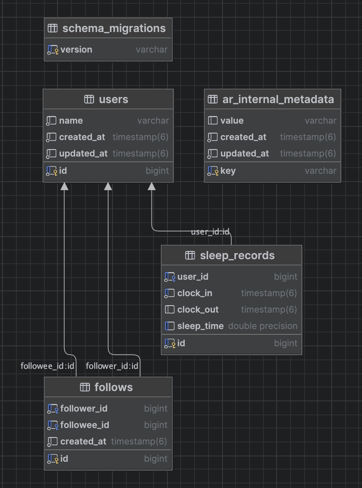

# Good Night

## Description
Good Night is the API service for manage user sleep records and support follow/unfollow feature for any user that's want to see their followee's sleep records.

## Onboarding and Development Guide

### Prerequisite

- [Install git](https://git-scm.com/book/en/v2/Getting-Started-Installing-Git)
- [Install docker](https://docs.docker.com/desktop/)
- [Install docker-compose](https://docs.docker.com/compose/install/)
- [Install RVM](https://rvm.io/rvm/install)

### Setup

- Clone this repo
  ```sh
  git@github.com:wisnuaga/good-night.git
  ```

- Install Ruby 3.2.2
  ```sh
  rvm install ruby-3.1.4
  ```

- Create poodle gemset
  ```sh
  rvm 3.1.4@good-night --create
  ```

- Setup Bundler
  ```sh
  gem install bundler
  bundle install
  ```

- Setup environment variables
  ```sh
  cp env.sample .env
  ```

## Database Schema


### Setup Database

- Run `rake db:create`
- Run `rake db:migrate`
- Run `rake db:seed`

Notes: Due to unsupported user registration yet, you can add more user on [seeds.rb](db/seeds.rb)

## Request Flows, Endpoints, and Dependencies
#### Endpoints
- [API Documentation](docs/api/api.md)

#### Stateful Dependencies
- PostgreSQL
- Redis
